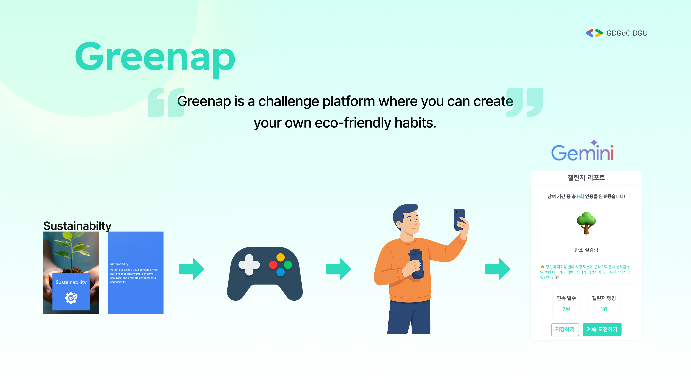
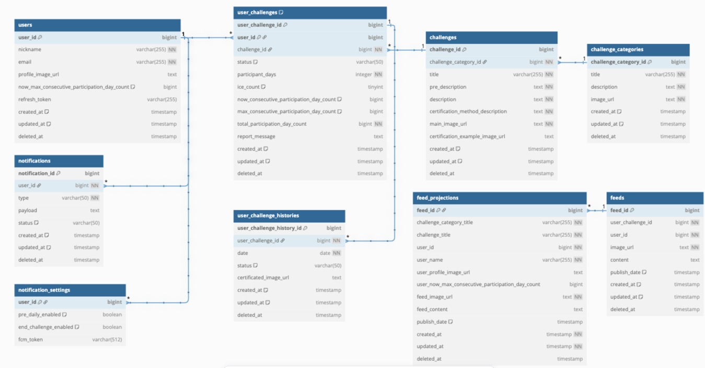
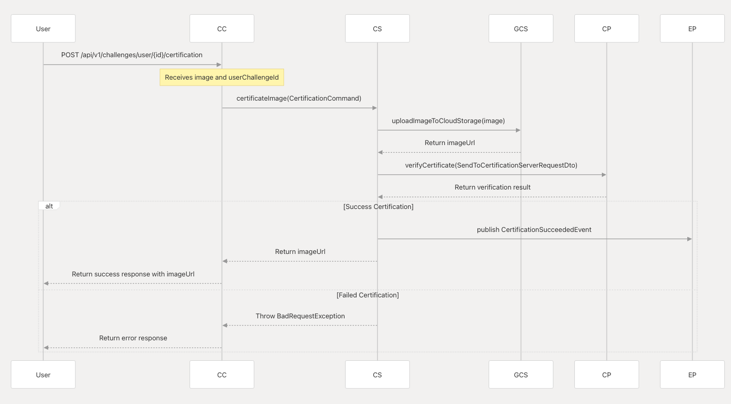
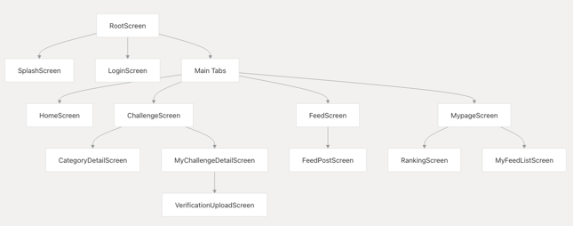
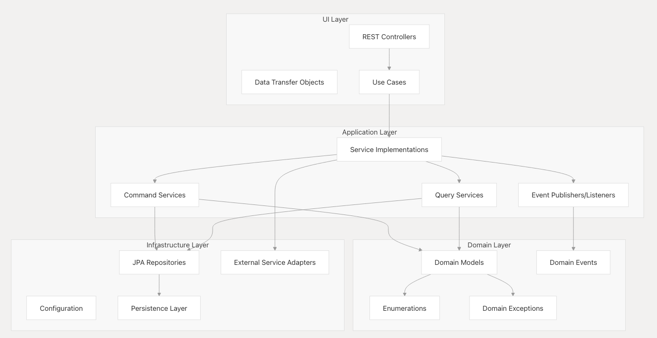
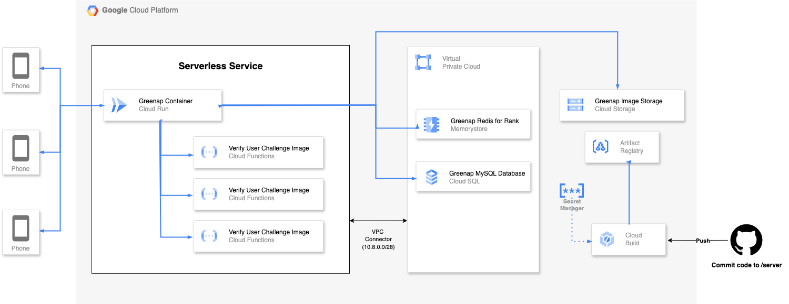

# 2025-APAC-SolutionChallenge-Greenap


<div align="center">




[](https://flutter.dev/)
[](https://spring.io/projects/spring-boot)
[](https://kotlinlang.org/)
[](https://www.mysql.com/)
[](https://redis.io/)

**Reducing digital carbon footprints through eco-friendly challenges**

</div>

## 📋 Table of Contents
- [Overview](#overview)
- [Features](#features)
- [Architecture](#architecture)
- [Technologies](#technologies)
- [Domain Model](#domain-model)
- [Challenge Categories](#challenge-categories)
- [User Flow](#user-flow)
- [Certification Process](#certification-process)
- [Client Architecture](#client-architecture)
- [Server Architecture](#server-architecture)
- [Deployment](#deployment)
- [Getting Started](#getting-started)
- [Contributing](#contributing)
- [License](#license)

## Overview

Greenap is a mobile application designed to help users reduce their digital carbon footprint by participating in eco-friendly challenges. The application enables users to join sustainability initiatives, track their progress, and get certified for their eco-friendly actions.

https://deepwiki.com/GDSC-DGU/2025-APAC-SolutionChallenge-Greenap/1-overview
## Features

- Participate in eco-friendly challenges
- Track challenge progress
- Certification for challenge completion
- Social feed for community engagement
- Points and rewards system
- User rankings

## Architecture

Greenap follows a client-server architecture with:
- Flutter mobile application frontend
- Kotlin Spring Boot backend
- MySQL for persistent storage
- Redis for caching and ranking functionality

## Technologies

| Component | Technology | Purpose |
|-----------|------------|---------|
| Backend | Spring Boot 3.4.4 with Kotlin 1.9.25 | Server application framework |
| Frontend | Flutter with GetX | Mobile application framework |
| Primary Database | MySQL 8.0 | Persistent data storage |
| Cache | Redis | Ranking and caching |
| Storage | Google Cloud Storage | Media file storage |
| Authentication | OAuth2 with JWT | User authentication |
| API Documentation | Swagger/OpenAPI | API documentation |

## Domain Model

The core domain model consists of several key entities that work together to provide the challenge participation and certification functionality:



## Challenge Categories

Greenap organizes challenges into four main categories that target different aspects of environmental sustainability:

1. **Energy Saving**
2. **Waste Reduction**
3. **Green Transportation**
4. **Digital Minimalism**

## User Flow

Users participate in challenges through a defined flow that tracks their progress from joining a challenge to completing it:

1. Browse available challenges
2. Join a challenge
3. Perform the eco-friendly action
4. Submit certification evidence
5. Receive verification
6. Earn points and rewards
7. Track progress on leaderboards

## Certification Process



A key component of Greenap is the challenge certification process, which verifies user participation:

- Users submit photos or other evidence of completion
- System validates the submission
- Points are awarded upon successful verification
- Completed challenges contribute to user rankings

## Client Architecture

The mobile client is built with Flutter using the GetX framework for state management and navigation.



The client follows the MVVM (Model-View-ViewModel) pattern:
- **Models**: Data structures representing challenges, users, etc.
- **Views**: UI components rendered to the user
- **ViewModels**: Business logic handling data processing and state management

Key screens include:
- Challenge discovery
- Challenge details
- Certification submission
- User profile
- Social feed
- Rankings

## Server Architecture

The server is built with Spring Boot and Kotlin, following a layered architecture with ports and adapters pattern:



- **UI Layer**: Controllers handling HTTP requests
- **Application Layer**: Services implementing business logic
- **Domain Layer**: Core business entities and logic
- **Infrastructure Layer**: External service integration


The server implements several key service components:
- User management
- Challenge management
- Certification processing
- Points calculation
- Rankings generation
- Event-driven notifications

## Deployment

The application is designed for cloud deployment, with Docker containerization for the server component:

- Containerized server application
- Cloud-based database services
- Cloud storage for media files
- CI/CD pipelines for continuous deployment

## Demo Video Link
[](https://www.youtube.com/watch?v=i1gcg9usD6Y)
👉 [Watch on YouTube](https://www.youtube.com/watch?v=i1gcg9usD6Y)

## Greener member

| Name                                        |Role        | Email                |
| -------------------------------------------- | -------------- | -------------------- |
| [JUNGSUN LEE](https://github.com/leejs0823)  | Lead, Frontend | dlwjdtjs01110@gmail.com |
| [HYUNSEOK OH](https://github.com/5hseok) | Backend, Server    | ohhs1010@gmail.com |
| [HYEJEONG YOON](https://github.com/Newooon)| Design| ggww001@naver.com|
| [MINGI HONG](https://github.com/bk123477) |AI|jackyh1@dgu.ac.kr|


## Getting Started

### Prerequisites
- Flutter SDK
- JDK 17 or higher
- MySQL 8.0
- Redis
- Docker (optional)

### Installation

1. Clone the repository
```bash
git clone https://github.com/GDSC-DGU/2025-APAC-SolutionChallenge-Greenap.git
```

2. Set up the server
```bash
cd server
./gradlew bootRun
```

3. Set up the client
```bash
cd client
flutter pub get
flutter run
```

## Contributing

Contributions are welcome! Please feel free to submit a Pull Request.

## License

This project is licensed under the [MIT License](LICENSE).

---

<div align="center">
  <p>Developed by GDSC-DGU for the 2025 APAC Solution Challenge</p>
</div>
